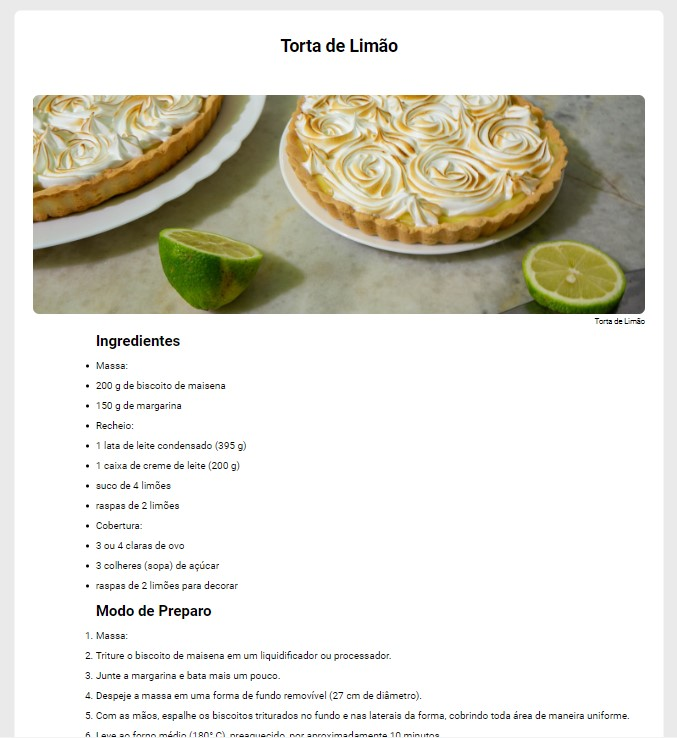

<h1 align="center">
 Desafio Discover Receitas
</h1>

  

  <a href="#-tecnologias">Tecnologias</a>&nbsp;&nbsp;&nbsp;|&nbsp;&nbsp;&nbsp;
  <a href="#-projeto">Projeto</a>&nbsp;&nbsp;&nbsp;|&nbsp;&nbsp;&nbsp;
  <a href="#memo-licença">Licença</a>

 
  
  

  

  

 

  

## 🚀 Tecnologias

Esse projeto foi desenvolvido com as seguintes tecnologias:

- HTML
- CSS

## 🚧 Projeto

Live Preview: https://github.com/Petersonmatias/DesafioReceitas.git

## 🎨 Inspiração:

Figma: https://efficient-sloth-d85.notion.site/image/https%3A%2F%2Fs3-us-west-2.amazonaws.com%2Fsecure.notion-static.com%2Fd5aadcb4-02e8-4c75-8ea1-7f69fd1e3cb2%2Freceita-html.png?table=block&id=ce46120e-c4c6-4645-bf4a-4eea98d2a773&spaceId=08f749ff-d06d-49a8-a488-9846e081b224&width=1910&userId=&cache=v2

## :memo: Licença

Esse projeto está sob a licença MIT. Veja o arquivo [LICENSE](LICENSE) para mais detalhes.

---

Feito com ♥ by Peterson

